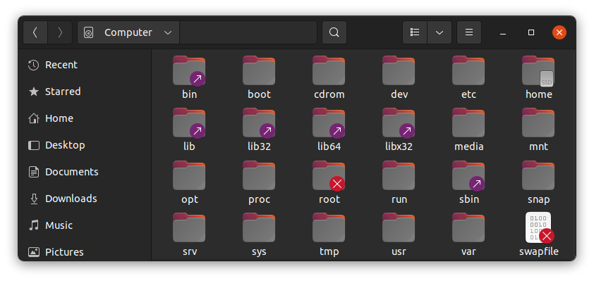
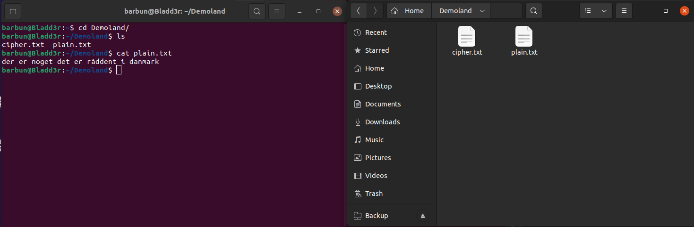
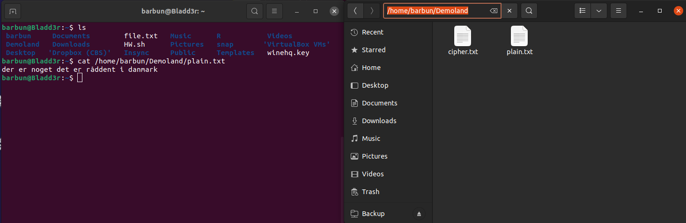
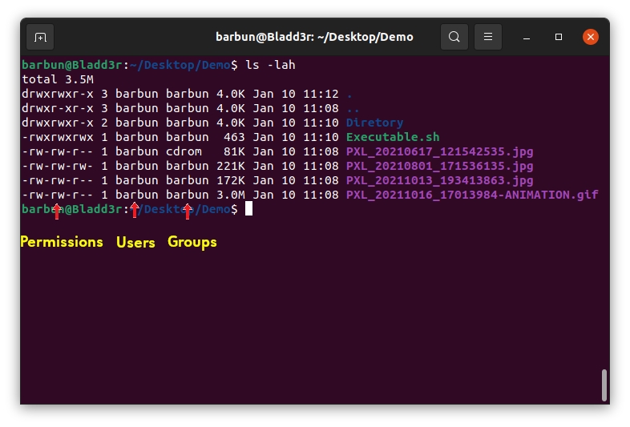
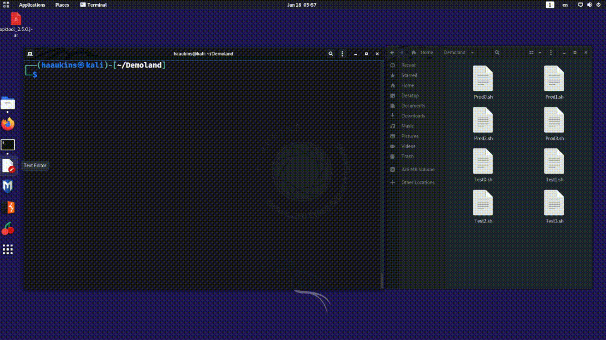
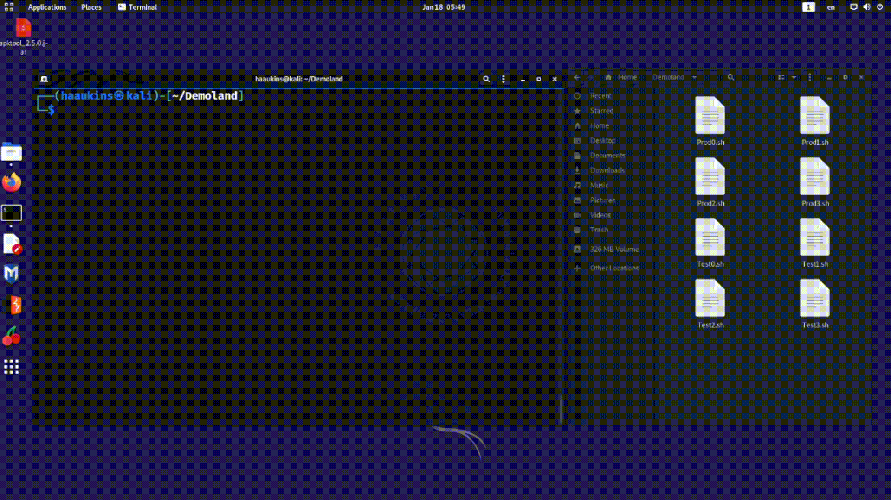
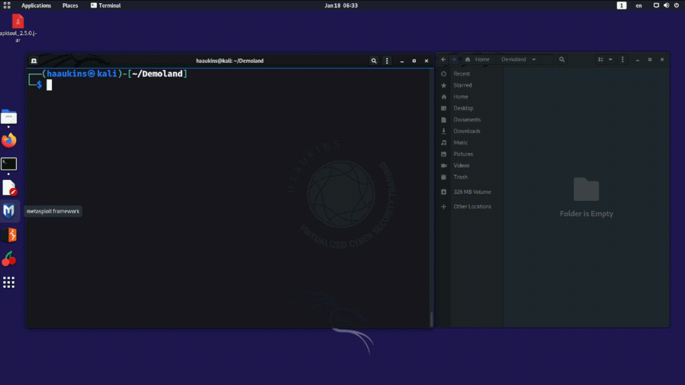

# Ye Olde Command Line

Gather around children, for I will tell you a story of guts and glory. Of days gone by.

In the olden days computers did not come with these puny GUI's, and the WYSIWG was not a thing. In the olden days, operators commanded the computers through . . .  THE COMMAND LINE.

That command line was a shell to issue commands for the computer to execute. Using this shell allowed us to traverse the file structure and run programs.

A programmer can develop and compile code to be run on the computer. But sometimes developing a whole program is an overkill. Sometimes you just want to combine some of the cool things your operating system can already do and automate them so you don't have to type in every single command every time you want to run a routine task.

Enter batch processing and shell scripts. You can write a list of commands to be executed into a file and save it as a shell script. This way computer will run the contents of the script in an uninteractive shell and carry out the tasks specified in the script.

As you can guess, command line still plays an important role today in any serious kind of usage. Sys admins, devs, and security experts often use the command line for one reason or another. 

While we will focus on linux, with the relatively recent addition of powershell windows also finally has a semi-decent shell that is not totally pathetic.

## File Structure

When modern operating systems were being designed, we used an analogy that was at the time familiar to almost everyone.The analogy of a file system. 

In the old days, the paper files would be stored in cardboard folders that would be stored in filing cabinets. It is likely none of you have ever seen a filing system in all its glory but you are familiar with the files, folders, and directories from the icons you see in your operating systems.

The idea is that the files in the operating system are organized hierarchically and you can traverse between these files

## Traversing the File Structure in Linux Command Line

Below are some simple commands to get you started.

|Command| Explanation |
|:---|:---|
| ls  | List directory contents  |
| cd  | Change directory  |
| .  | This directory  |
| ..  | Parent directory  |
| /  | Root directory  |
| ~  | Home directory  |
| -  | Previous directory  |

You may want to check this out right away. Connect to Haaukins with the provided login information and open up a terminal window. 

You can see us browsing the folders in both command line and through the file explorer GUI at the same time. 

We issue ls command to get a list of files and folders which match what you see through the GUI. We use cd to change directories.

***A Brief Note About Absolute and Relative Paths***

You may want to pay attention to absolute or relative paths. When you are in a folder, you can just refer to the files with their names without needing to specify the absolute location of the file in the file system. This is the most basic example of the use of relative path. Relative paths only work if your context matches the context of the relative path.

Absolute Path is the exact address of the file. Specifying every folder along the way. It always works no matter your context. Problem is that it is a bit inflexible. So when the file is not in the exact same location in another system, it will fail miserably. 

If the difference between absolute and relative paths is not immediately clear to you, don't worry. It will become clear as you have headaches caused by misspecifying the path one way or another.

## File System Operations

Getting around in the file structure is great, but wouldn't it be better if we could do more? Here are some additional commands you may want to know about.

|Command| Explanation |
|:---|:---|
| mkdir | Make directories |
| cp | Copy files and folders |
| mv | Move files and folders |
| rm | Delete files and folders |
|rmdir | Remove empty folders |

You can see us using some of those commands in action above. First we created a folder with mkdir and then copied the file from desktop into the new folder. Then we proceeded to move the file (essentially renaming it) and finally deleting the file.

## File Permissions

Life would be easy for attackers and quite hard for defenders if any user could do anything to any file. Luckily for us, in our reality files in Linux belong to certain users and groups. This determines who has how much access.

The access is determined at three levels: The User, The Group, and the Others.

The long line of characters in the beginning such as drwxrwxrwx indicate the following:

First character - or d indicates if this is a directory.

The next three indicate if the user has read, write, and execute access.

The next three indicate if the group has read, write, and execute access. Users belonging to this group will have these rights on the files.

The last three indicate if the others unspecified has read, write, and execute access.

As you can guess this is a pretty fundamental part of security. When you see a file with write and execute rights for others, you can essentially replace this file contents with any malicious script you want and execute it without much trouble.

You may want to read more about chown and chmod commands but those are out of our scope for this activity.

## Useful Shell Tips

### Autocompletion

If you want to quickly complete a file or a folder's name you can just press the tab key on your keyboard. In Zsh it will also iterate over alternatives as you press tab again and again. This is not the default behavior in Bash. Don't worry if you don't know the difference.

### Wildcards

Wildcards are place holders for other characters. The * matches any number of random characters.

Let us say you want to do something to all the files in a folder. You can easily just use * and it will match everything in the folder. Below will copy all the files in this folder to Ransom folder

    cp Desktop/* Ransom/

You can also use it for partial matching. The following command will only display the files and folders starting with D.

    ls D*

Here is a gif file that shows these principles in action. Click to access a narrated video file if needed.

In this example you see us using P* to get a list of files that start with P. We then move these files to a folder and delete all the rest of the files.

### History

Every command you issue in the shell is saved in a history file. The main purpose for this is for your convenience.

If you press the up arrow key on your keyboard you can see the previous command you issued. Press it again and it will show the command before that, and the one before that...

You can also search this history through ctrl + r keycombination. Press ctrl + r and start typing the command. Press ctrl + r again to see additional matches.

Yes this history file can contain passwords if the user had been careless. So mining these history files is a viable way to get some credentials given the users have been careless.

 This work is licensed under a [Creative Commons Attribution 4.0 International License](http://creativecommons.org/licenses/by/4.0/).