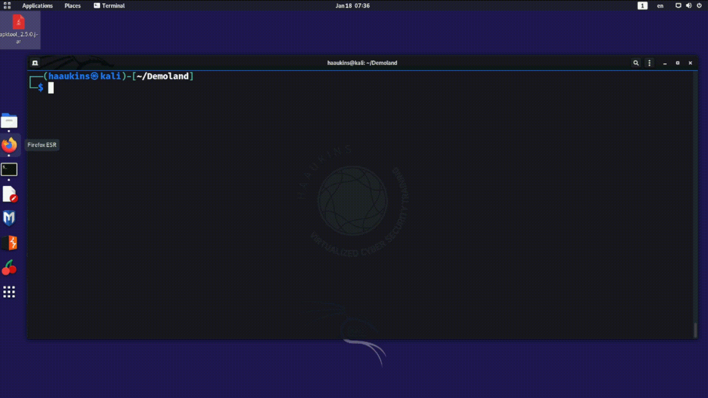

# Redirects

Very often we would want to chain the output of one command into another. The redirection in the bash shell allows us to do this without cumbersome intermediate steps. Above are some of the most commonly used operators to carry out the redirection.

|Operator| Explanation |
|:---|:---|
| > | Take output on the left and overwrite file on the right |
| >> |Take output on the left and append to file on the right |
| \| | Pipe output of the left and feed it into the input of the right |

## > Operator

You can see the first command also creates the file with the line "ONE". Then we display file contents with cat. 

Second command overwrites the file contents. Then we show the file contents were indeed overwritten with cat.

## >> Operator

You may note that the difference here is that the file contents weren't overwriten but appended.

This is very useful if you want to keep a log file or similar.

## \| Operator

The pipe operator takes the output of the command on the left and places it as input for the command on the right.

In the gif you see the long output of the ps command (it lists the processess running on the system). By default ps output is quite long. Finding what we are looking for in it is like looking for a needle in a haystack. But we can filter the output of ps with the grep command. Grep will only return the lines that include the keyword. 

In this example we are interested in firefox processes. So we use the grep command to filter the output.

Here is another classic example: 

    sudo netstat -anp | head -n 5

netstat produces quite a long output of all connections. By piping it through head, we can get the top few observations.

# Process Control Basics

While there is quite a bit more to context in bash, here is the most basic things you need to know if you want to get anywhere with bash.

## Sequential Execution With ;

; operator instructs bash to finish running the command on the left before running the command on the right. The commands will get executed even if the first command errors out.

    echo "One" ; echo "Two"

Or if you are familiar with linux at all the ever present example:

    sudo apt update ; sudo apt upgrade

In the below gif, you see we use the previous example of ps and grep to get even more useful output by including the headers. The problem with our previous attempt was that we wouldn't know what columns the information presented belonged to. By sequentially executing a command to only display the headers then to display the filtered information we can gain a more useful output of the firefox processes.

## Running Commands in a Subshell with &

Then there are those times, you just want to issue the command and let it running in the background.

This is especially useful if the command will take a while to run and you don't want to (or can't) use another terminal window. Or more relevantly, if you are remotely connected to a server with ssh and you want the command to keep running after you end your ssh session.

A linux ISO is always good to have, but it is quite sizable and would take a while to download. So you may want to run the download in the background while you go about your own business...

	wget https://ubuntu.com/download/desktop/thank-you/?version=21.10\&architecture=amd64 & exit

### Useful Commands for More Process Control

Below are some commands you can use to control the processess running on your linux system.

| Command | Explanation |
|:----|:----|
| top | Display the top processess running. |
| ps  | Report a snapshot of current processes.|
| kill | Kill a process. |

In the below example you can see that I mistakenly created a process that would run in the background for a long time. We use ps to identify the process id (PID) and kill -9 to kill the process with extreme prejudice.

 This work is licensed under a [Creative Commons Attribution 4.0 International License](http://creativecommons.org/licenses/by/4.0/).

