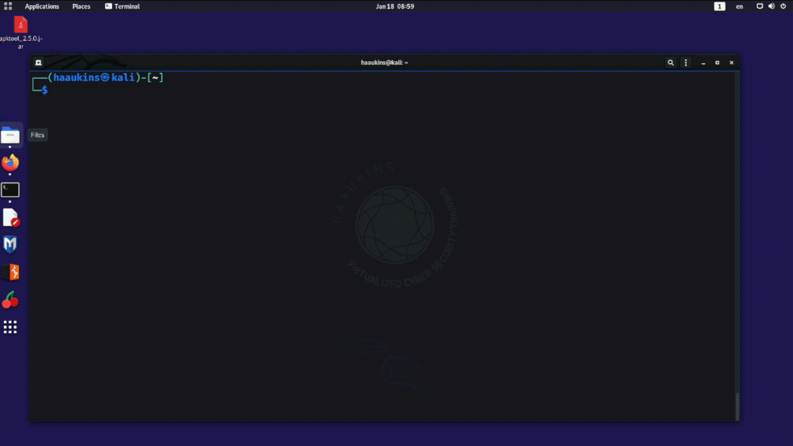

# Variables

One of the core concepts of any programming language, variables are also part of linux commandline. 

## Predefined Variables

Some variables are defined in advance for smooth operation of the operating system. For example, the commands you use are kept in folders like /bin , /sbin, etc. You don't need to specify the absolute path because those folders are included in a variable called PATH.

The way you access a variable once it is defined is to use the \$ with the variable name. Here is an example:

    echo $PATH

Another example is USER. This is your current user, so even if you don't know the user name, you can refer to it using this variable.

    echo $USER

If you can't immediately see the value of these variables, consider a situation where you gained shell on an unfamiliar system and need to do basic things. The experience is akin to being totally in the dark. These variables and others like them allow developers, administrators, and third parties to have access to functionality without needing to know the minute details of each system's configuration. You don't need to know where python executable is, so long as it is in one of the folders in $PATH.

These come in very handy if you are writing a script that is supposed to be portable. By using the predefined variables you don't need to know the exact configuration of the system. The configuration is communicated in some of these variables.

In the below example, we are dropping a friendly note in the users directory. Yes, I know. I could also have used ~ . Use your imagination. Usefulness of this approach will come to you.

## Setting New Variables

We probably won't be completely content with variables already defined by the system. So let us learn how we can define variables of our own. 

This may appear a bit counter intuitive, but setting new variables does not require you to use \$ operator.

    variable="Hello!"
    echo $variable

You set them without a dollar sign and recall them with the dollar sign. NOTE THE LACK OF WHITESPACES.

Note that below doesn't work the way you probably expect it to work:

    echo variable

In the video we define a list as a variable and iterate over the list with a for loop.

You may want to unset the variables once you are done.

## Creating Variables from Command Output

If you want to create variables from the output of a command then you need to use $(). Whatever you include between the brackets will be evaluated first and then its output will be returned.

    DISKUSE=$(du -sh ~)
    echo $DISKUSE

Here we are saving the output of the disk use command into DISKUSE variable.

## Making Persistent Variables

What you will quickly notice is that the variables you define in a shell session do not persist across other sessions. They are simply gone soon as you switch terminal windows or launch a new one.

There are various ways of making variables that persist across shell sessions. Correct method depends on scale and scope of your ambitions. For example, if you only want variables to be available to child shell sessions, then you can simply export the variable.

If you want to have a variable persist for the user after restarts, one way is to just include your variables in the .bashrc file.

.bashrc is a hidden file with bash config for the user. It is evaluated every time the user launches a new session. It is often used to set custom aliasses for commonly used commands (ll instead of ls -lah) and custom path variables.

Let us say we want a variable that points to the friendly note we left earlier.

	RANSOM=/home//$USER/ransom.txt

Then we can add a line like this to .bashrc file.

	echo "RANSOM=/home//$USER/ransom.txt" >> ~/.bashrc

And we can even add one more line to make sure the friendly message is displayed next time the person opens up a terminal.

	echo "cat $RANSOM" >> ~/.bashrc

There are ofcourse other, better places to leave friendly notes... I will leave that to your imagination.

 This work is licensed under a [Creative Commons Attribution 4.0 International License](http://creativecommons.org/licenses/by/4.0/).