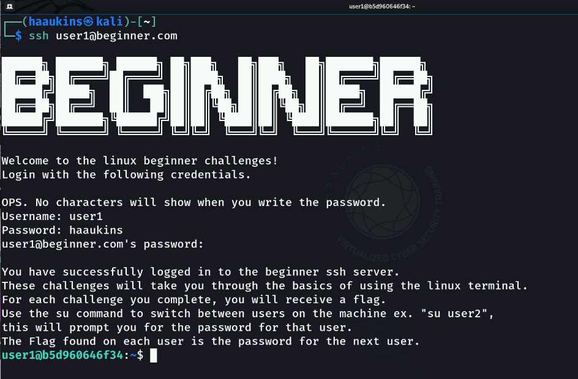

# Exercise

For this module's exercise session, we will follow along Haaukins' Linux Walkthrough Exercise.

Once you successfully complete each exercise you will find a flag. Flags are the letters HKN followed by a series of random letters and numbers in curly braces. A flag may look like this: HKN{QX-DE-WdSQP9}.

Once you find the flag, go back to the challenges page of your haaukins web site and enter the flag into the corresponding challenge. This will award you the points.

To begin you will need to connect to another computer using ssh. Here is how you do it:

1. Open the terminal window.
2. Type in the following without the quotation marks: 'ssh user1@beginner.com'
3. When prompted enter the following password: haaukins
4. If you see something that looks like what is in the image below, you are ready.

## List and Read

List the home directory to get the name of flag file and read it.

## Hidden Files

Find a way to list hidden files within a directory, in this specific case, user2’s home directory. If you have not closed the ssh session login to user2 with the following command ‘su user2’. Use the flag from ‘List and read’ as the password.

## Grabbing Information

Searching through long pieces of text for specific information can be a pain. Search ‘longtext.txt’ for the flag prefix ‘HKN’, scrolling through the file wont be efficient here. Login to user3 with the flag from ‘Hidden files’ as password.

## Find the File

Find a command which can search through directories for specific files. The file to be searched for is ‘findme.txt’. Search the whole system AKA ‘/’. Login to user4 with the flag from ‘Grabbing information’ as password.

## Copying Files

Copying files is an important task ex. to create backups. Copy ‘flag5.txt’ from ‘/root/’ into your home directory to be able to read it. Login to user5 with the flag from ‘Find the file’ as password.

## Moving Files

Moving files in linux can not only be used to move files but also rename them. Move ‘flag6.txt’ from ‘/root/’ into your home directory and read it. Login to user6 with the flag from ‘Copying files’ as password.

## File Permissions

In some cases you will have to change the permissions of a file/directory to achieve your goals. To be able to read the flag in your home dir, change it’s permissions. Login to user7 with the flag from ‘Moving files’ as password.

## Executing Custom Binaries

Executing custom binaries is not like writing commands. Find a way to execute the flag8 binary within your home dir. Login to user8 with the flag from ‘Changing file/directory permissions’ as password.

 This work is licensed under a [Creative Commons Attribution 4.0 International License](http://creativecommons.org/licenses/by/4.0/).