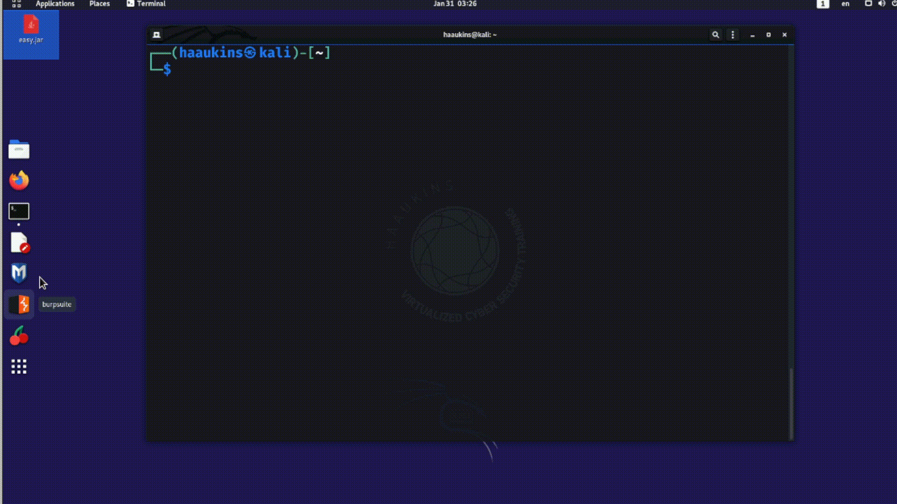
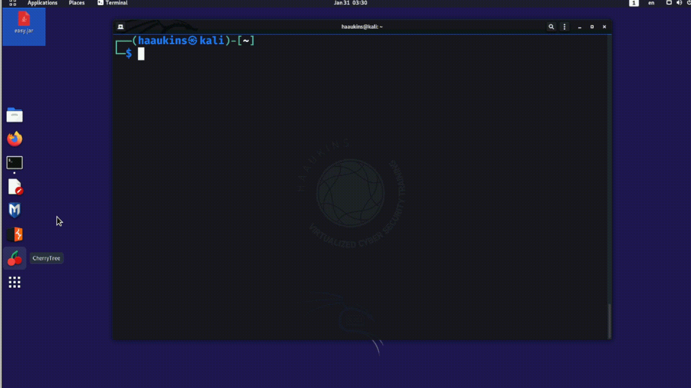
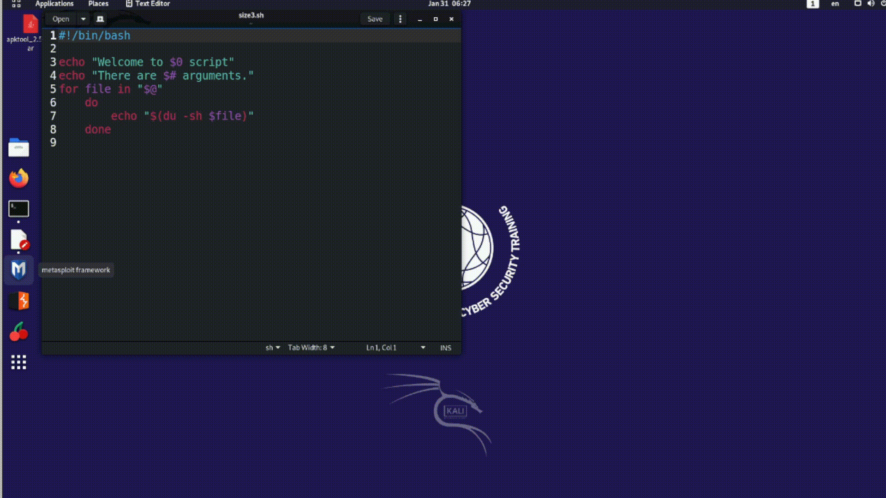

# Getting Into Arguments with a Script

A script that just runs a series of commands when executed is pretty useful. What would make it even more useful is if we could alter its behavior depending on arguments we pass to the script.

Wouldn't it be nice to display some help text when user passes an argument? Or to be able to direct the script to a list of files and folders to process rather than relying on what is in the working directory or absolute paths? In this and the next activity we will learn how to do those things.

## Reading from the Command Line

One way to do this is to run the script without any arguments, and then have the script elicit the user input.

The script outlined below will report file size of a file that is specified.

    #! /bin/bash
    
    echo "Enter file name:"
    read file
    
    size=$(du -sh $file | awk '{print $1}')
    
    echo "$file is $size."

Save this script as size.sh and execute it. You will need to make the script executable and call it from the terminal (detailed in the previous activity). When prompted specify /etc/passwd as the file.

The problem with this is you need user interaction after the script starts running. Which may or may not be desirable.

Below you can see this script in action.

## Passing Arguments to the Script

Another way is to allow the script to be called with parameters. This way you can specify the arguments while calling the script and go about your business while script runs.

Let us say we want to be able to call the script like so:

    ./size2.sh /etc/passwd

Then we can rewrite the script as follows:

    #! /bin/bash
    
    size=$(du -sh $1 | awk '{print $1}')
    
    echo "$1 is $size."

Below you can see the new version of this script in action.

## Passing Multiple Arguments to the Script

As you can guess, each additional argument will be named iteratively as $1, $2, $3, . . . and so on.

| Special Variables | Explanation |
|:----|:----|
| $0 | Name of the script. |
| $1, $2, . . . $n| Arguments to the script |
| $# | Number of arguments to the script |
| $@ | All arguments to the script |

Here is a script that takes multiple arguments:

    #! /bin/bash
    
    echo "Welcome to $0 script"
    echo "There are $# arguments."
    
    # Iterate through arguments and get size for each
    for file in "$@"
        do
            echo "$(du -sh $file)"
        done

Save it as size3.sh, make it executable. Then call it like so.

    ./size3.sh /etc/passwd Desktop/*

This is trivial, so I won't go into details. See below how it works.

 This work is licensed under a [Creative Commons Attribution 4.0 International License](http://creativecommons.org/licenses/by/4.0/).