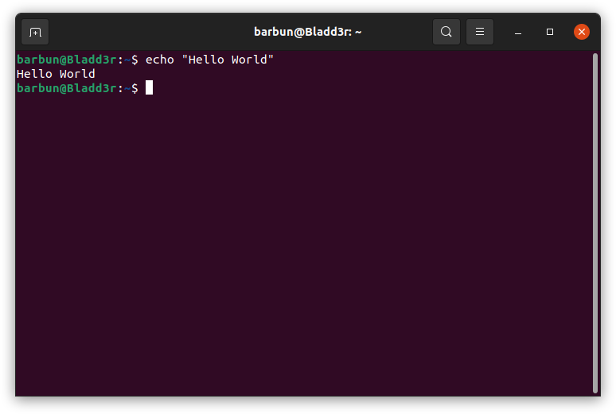

# Linux Command Line Basics

In this module, we will learn the basics of Linux command line.

The module is comprised of the following activities. The students are encouraged to carry out the exercises explained in the activities in Haaukins.

[01 - Bash Basics](M4_01_BashBasics.md) In this activity we learn about the command line and file structure. We learn how to find our way in the file structure, as well as file operations.

[02 - Redirects and Basic Process Control](M4_02_RedirectsAndBasicProcessControl.md) In this activity we learn about how to redirect output of commands into files and other commands. We also touch upon basics of process control.

[03 - Variables](M4_03_Variables.md) In this activity we learn about variables in linux command line.

[04 - Conditional Execution and Loops](M4_04_ConditionalExecutionAndLoops.md) In this activity we learn about if statements, for and while loops in linux command line.

 This work is licensed under a [Creative Commons Attribution 4.0 International License](http://creativecommons.org/licenses/by/4.0/).

